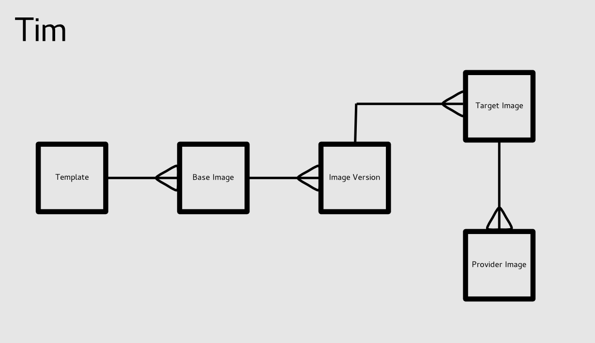

# Tim Object Model

## Relationships

## Templates
Templates are the resources that describe your image.  Templates take the form of a TDL (Template Definition Language) document.  TDL is part of the Oz project (the tool that ImageFactory uses by default for building images).  To find out more about TDL please see: [Oz Template Description Language](https://github.com/clalancette/oz/wiki/Oz-template-description-language)

The TDL Schema in RNG form can be found [here](https://github.com/aeolusproject/oz/blob/master/docs/tdl.rng)

[Templates REST API](rest/templates.md)

## Base Images
Base Images are the top level image object in Tim.  They are essentially used to group together a number of related image objects.  A base image is associated with a single template resource.  All image objects, Target Images, Image Versions and Provider Images associated with this Base Image will be built using the associated template.

Base Images can also hold meta-data that applies to the group of image objects.  Such as name, description, tags and so on.

To create an image and push it to the cloud you should start by creating a Base Image object, then create the subsequent image objects.  Please read the Image Version, Target Image and Provider Image sections for more information.

[Base Images REST API](rest/base_images.md)

## Image Version
An Image Version is the next level down from the Base Image resource.  An Image Version represents a build of an image that has happened at some point in time.  The build, which is actually a raw disk image (for upload style) is created by Image Factory.  This raw image is then translated into various Cloud formats (such as AMI, VMDK, GCOW2, etc...).

By using Image Version Tim can guarantee that all subsequent target and provider images are exactly the same in packages, versions and configuration.  (A Build done at a different point in time could include different package versions and so on, depending what is available in the repositories at build time).

[Image Version REST API](rest/image_versions.md)

## Target Image
A Target Image is the resulting cloud specific image, once an image version has been translated into the correct format.  For example, creating a Target Image for Amazon EC2, will translate the resulting raw disk build associated with an ImageVersion, producing an AMI.

**Note**: Snapshot style builds, do not create a local raw disk image or a local target image.  Though the Image Version and Target Image resources are still required in the resource chain.  This is to keep the workflow consistent.

**Note**: Importing images behaves similar to Snapshot style builds, but does not actually create or register an image at the time of creating a provider image.  Instead, the resource chain is kept consistent and a reference to the Cloud specific ID is saved in the provider image.

[Target Images REST API](rest/target_images.md)

## Provider Image
A Provider Image is an Image that has been created and registered with a particular Cloud.  For example, once an image has been built and translated to Amazon EC2 format, resulting in an AMI.  Creating a provider image for this target image would result in that AMI being uploaded and registered with Amazon EC2.

**Note**: Importing provider images does not actually create or register an image at the time of creating a provider image.  Instead a reference to the Cloud specific ID is saved in the provider image.

[Provider Images REST API](rest/provider_images.md)